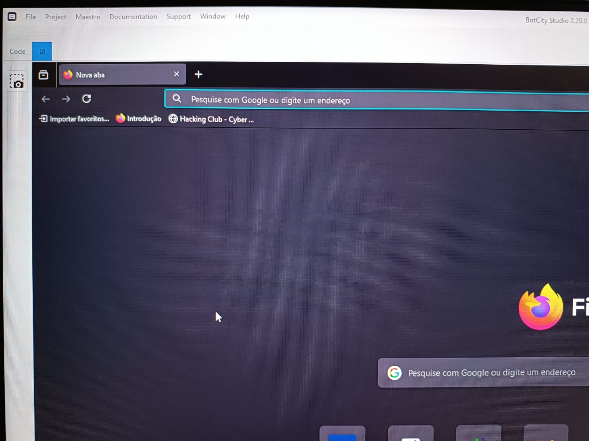
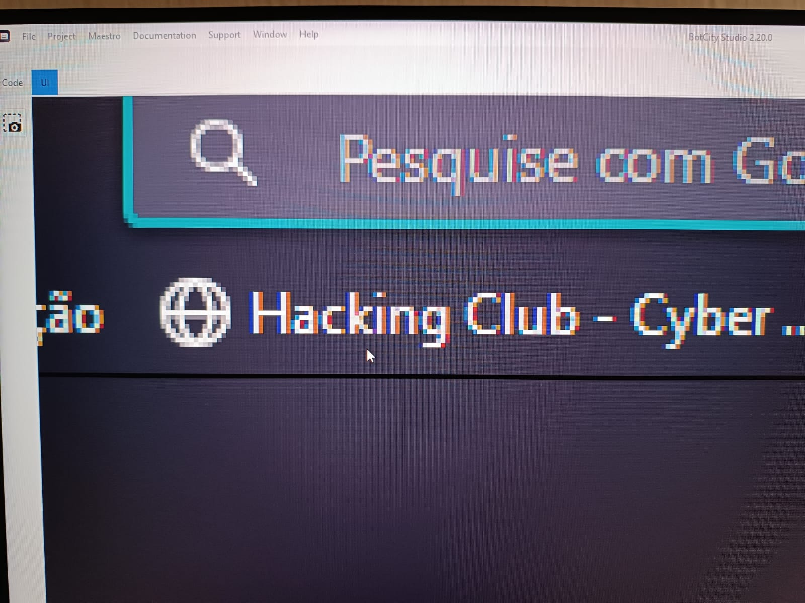
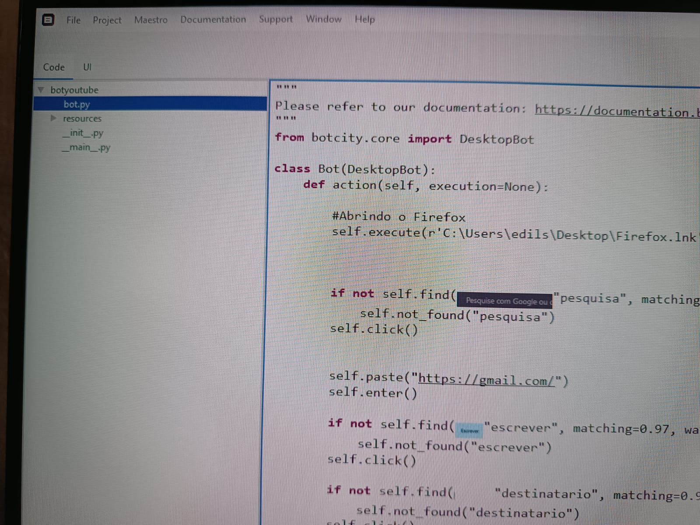
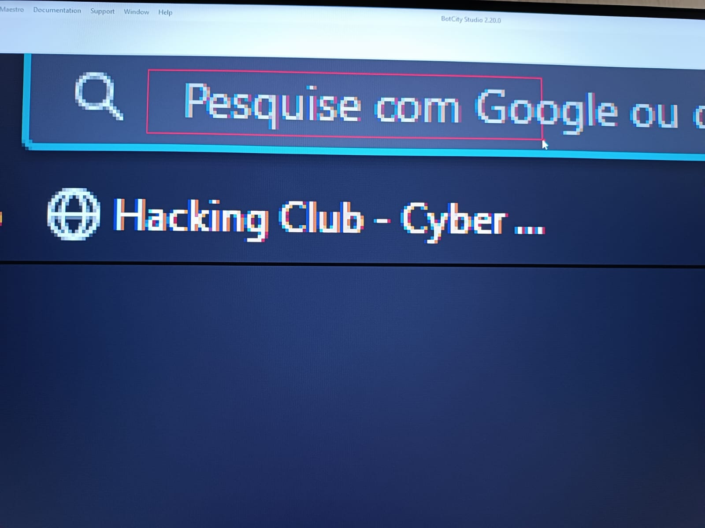
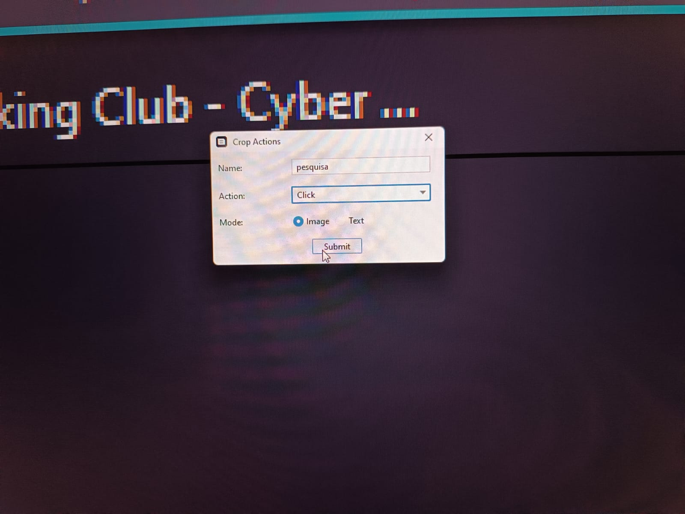
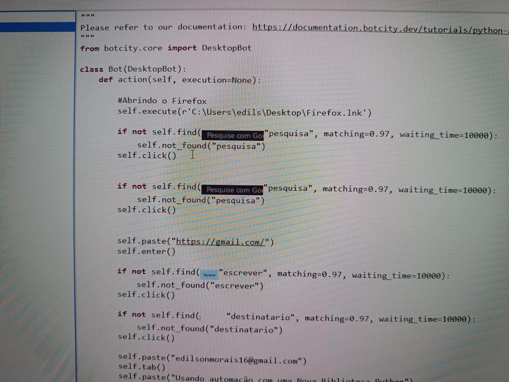
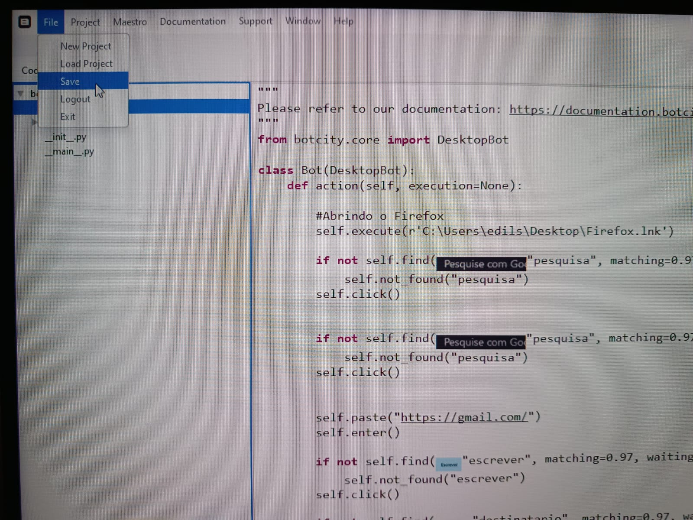

# Automação com BotCity

<div style="text-align: justify;">

A BotCity é um software de automação RPA high-code com foco em automações em Python RPA. Se destaca pela sua flexibilidade já que permite a personalização ilimitada das automações de acordo com as necessidades da empresa.

### Benefícios de usar Python RPA em suas automações:


**Não há bloqueio:**

- As automações Python são apenas código puro; você pode usar qualquer editor de código ou plataforma de sua escolha para desenvolver os bots, executar as automações onde quiser e compartilhá-las com sua equipe;

**Escalabilidade e desempenho:**


- O RPA em Python é mais escalável do que as plataformas de low-code porque oferece suporte à integração com outras ferramentas e tecnologias e tem um desempenho mais rápido (3x-20x). Você pode criar automações complexas (Web, desktop, legado, Android) em qualquer sistema (Win/Linux/Mac), lidar com grandes volumes de dados e usar computação elástica (VMs, contêineres, sem servidor) que é dimensionada conforme a capacidade necessária.

**Flexibilidade:**

- Embora as plataformas de RPA low-code sejam amigáveis para usuários não técnicos, elas são bastante restritivas em termos de personalização e requisitos. Com o Python, você tem acesso a mais de 440.000 bibliotecas e ferramentas (fonte: Python Package Index) para criar automação altamente sofisticada (em qualquer sistema: Web, desktop, móvel, legado).

**Custo:**

- No modelo de licenciamento das plataformas low-code, você pode aumentar rapidamente os custos à medida que dimensiona seus esforços de automação, além do desafio de gerenciar as licenças para que não haja tempo de inatividade e um ROI mais atraente nos projetos. Com o Python RPA, não há taxas de licença nem restrições de uso: é código puro, o que possibilita a criação e a implementação de suas automações sem incorrer em custos adicionais, permitindo mais projetos com um ROI atraente.

</div>

# Sobre o projeto Botyoumail 

É uma automação de envios de mensagens automáticas utilizando o gmail.com


## Índice

1. [Instalação](#instalação)

2. [Configurando o BotCity](#configuração)

3. [Iniciando](#iniciando)

4. [Contato](#contato)


## Instalação

**Pré-requisitos**:

 - Precisa-se criar uma conta no site do [BotCity](https://pt-br.botcity.dev/)
 - Precisa-se instalar o `cookiecutter`

## Passos para a configuração:

1. **Entra no site, depois que se cadastrar, e baixa a ferramenta BotCity Studio**:


2. **Extrai o arquivo wizard.rar em uma pasta(ele terá três arquivos)**
      - wizard-2.1.0.exe
      - diagnostic-1.2.0.jar
      - pasta win32


3. **Instala o arquivo winzard-2.1.0.exe**


4. **Entra com suas credenciais criadas no site da BotCity**


## Ferramentas

Utilize a ferramenta do seu gosto. Aqui eu utilizei a IDE PyCharm Community

No terminal do PyCharm:

```bash
pip install cookiecutter
```

### Para vincular ao PyCharm:

1. **Digite os seguintes comandos dentro do terminal da IDE:**
  ```bash
cookiecutter https://github.com/botcity-dev/bot-python-template
  ```
2. Escolhe a opção: **1 - Desktop**


3. bot_id: **botyoumail**


4. project_name: **botyoumail**


5. Descrição do projeto: **Meu primeiro projeto de automação com o BotCity**

### Para instalar todas as bibliotecas que o bot precisará:

```bash
pip install -e botyoumail
```

 - botyoumail (que é a pasta do projeto onde o local do setup.py se encontra)


**OBS:** Se tudo ocorreu de maneira correta, aparecerá uma pasta com o nome `botyoumail.egg-info` e dentro do código do arquivo `bot.py` aparecerá: 

```bash
self.browse("http://www.botcity.dev")
```

Ao executar este código, o navegador padrão do seu sistema abrirá no site da botcity

## Configuração

## Configurando o BotCity

### Dentro da pasta Wizard:

1. Instale o executável wizard-2.1.0.exe;
2. Coloque suas credenciais(email e senha);
3. Clique em Launch Studio

### Com o programa BotStudio aberto:

1. **Menu File > New Project**
2. Nome do Projeto: **botyoumail**
3. Project Folder: **procura onde a pasta do projeto se encontra, no caso, a pasta botyoumail que o PyCharm criou**
4. Source Code: **vai na pasta do bot que também dei o nome de botyoumail**
5. Resoucerces Folder: **abre a pasta do botyoumail e seleciona a pasta resources**
6. Create

## Iniciando

### Começando a fazer de fato as automações

Tudo que iremos fazer vai ser dentro da class Bot (locazilado no arquivo `bot.py`), como é mostrado abaixo:

```python
class Bot(DesktopBot):
    def action(self, execution=None):
       
        #Abrindo o Firefox
        self.execute(r'C:\Users\edilson\Desktop\Firefox.lnk')

        if not self.find("pesquisa", matching=0.97, waiting_time=10000):
            self.not_found("pesquisa")
        self.click()        

        self.paste("https://gmail.com/")
        self.enter()
```

A linha de código: `self.execute(r'C:\Users\edilson\Desktop\Firefox.lnk')` abrirá meu navegador

1. O restante funciona ao tirar print da tela do navegador, o Bot Studio irá captuar a imagem na aba UI: 



2. Nela clica na parte de pesquisa da imagem do navegador que será dado um zoom: 


 
fazendo isso, primeiro será dado um zoom na parte clicada, depois você seleciona a área escolhida. 

3. Antes de clicar, verifique onde a posição do cursor do mouse na aba Code do Bot Studio:



4. Selecione o campo a ser clicado pelo o bot:



5. Agora escolha um nome, a ação `Click` e `Submit`:



6. O código irá aparecer onde o cursor do mouse estava



7. Lembre-se de salvar:



Pronto, ao fazer tudo isso, o código do projeto na IDE PyCharm também será atualizado. Ao executar o projeto tudo funcionará perfeitamente!

## ATENÇÃO

Para mais informações acesse a documentação do [BotCity](https://documentation.botcity.dev/tutorials/python-automations/desktop/).

## CONTATO

- **LinkedIn:** [Edilson Freire](https://www.linkedin.com/in/edilson-freire-37a06ab1/)
- **Email:** analistadesistemasedilson@gmail.com